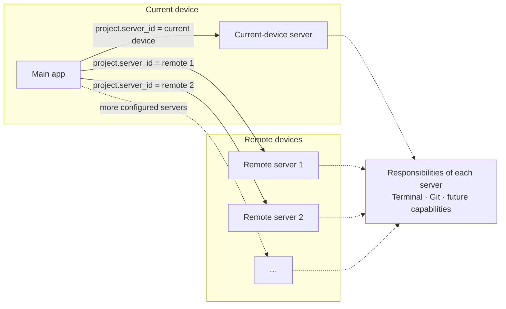
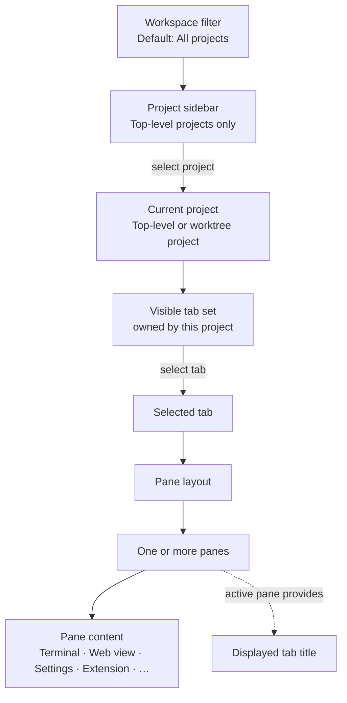

# App model

This document separates the app/server boundary from the way users navigate
projects, tabs, and panes.

## Main app and servers

The diagram expresses a product boundary, not a process or network design.

- The first version has exactly one server, the current device. Remote servers
  can be added in later versions; the model already allows several.
- The main app may organize projects from the current device and several remote
  servers at the same time.
- A project record selects the server that handles work for its directory
  through its `server_id`.
- A server-bound pane inherits that route through its tab and project.
- A worktree project uses its parent project's server while supplying its own
  directory.
- Switching the current project may therefore switch the responsible server;
  there is no separate global "active server" selection, and the sidebar has
  no server selector.
- Servers are defined and stopped from settings.
- The current device is the default server shown by server-related settings.
- Current-device and remote servers have the same conceptual responsibility;
  their operational differences are deferred.

### Disconnected server

When a project's server is not running or not reachable, the project is still
loaded and is not in a failed state. App-only panes in its tabs work normally.
The bottom status bar shows disconnection and an action to connect; healthy
connections need no indicator.
Terminal panes keep their last available content visible. Disconnection does
not mean that the session has ended.

### Ended and unreferenced sessions

A terminal pane whose session has ended stays open with its saved screen and
retained history, marked as exited. It accepts no terminal input, but its
content remains available for scrolling, search, selection, and copy. Relaunch
preserves these panes; if saved content is unavailable, the pane explains why.
Closing the pane removes it immediately, ends its session, and discards its
saved content. If the server is unreachable, termination stays pending until
reconnection, including after an app restart. Closing the last pane closes the
tab. Sessions that no pane references are listed so the user can attach one to
a new pane or end it.

Quitting the app leaves sessions running. End All Sessions and Quit ends all
live sessions on the current-device server and clears the app's terminal tabs
and their saved content before quitting.

## Navigation and visible context

The workspace filter changes which top-level projects are listed. The current
project may be that top-level project or one of its worktree child projects.
Choosing a worktree child, listed beneath its parent in the sidebar, changes
the current project and therefore the visible tab set.

The current project, the selected tab, and the focused pane are view state
that belongs to the window, not to a project or tab. There is one active pane
for the entire window. Tabs may later be laid out side by side, each with its
own panes; that does not introduce a separate active pane per tab. The first version opens a
single window, but a later version may open several, including the same
project in two windows at once, without changing how projects store their
tabs.

When the active pane closes, focus moves to an adjacent pane in its tab. If the
whole tab closes, focus moves to the first pane of the next neighboring tab,
or the previous tab if there is no next tab. Closing an inactive pane or tab
never steals focus. Normal tab selection may restore a pane from the window's
focus history. A tab without window focus displays its first pane's title.

On launch the app restores every project, its tabs, and the window's view
state. Quitting the app leaves every session running; a separate action ends
all sessions and quits.

| User action | Changes | Does not change |
| --- | --- | --- |
| Filter by workspace | Projects visible in the sidebar | Project identity, membership, or server |
| Choose a top-level or worktree project | Current project, directory, and visible tab set | Other projects' saved app state |
| Select a tab | Visible pane layout | The tab's owning project |
| Focus a pane | Active pane and displayed tab title | Ownership of any pane |
| Close the last pane in a tab | The tab is closed | Other tabs of the project |
| Change directory in a terminal | That terminal process's current directory | Pane, tab, project, or server ownership |

## Settings as pane content

Settings follows the same tab-and-pane composition as other content. It is an
app-only pane, so it can be opened in any project, including the Home project,
and does not depend on any server being available. A settings pane may expose:

- settings owned by the main app; and
- settings for a selected server, defaulting to the current-device server.

App settings live in one configuration file that is their source of truth; the
settings pane edits that file. Keyboard shortcuts are settings: every action is
registered in one shared system that the user may override. This includes app
actions, text fields, menus, pickers, and buttons, with their contexts and aliases.
Ordinary terminal keystrokes remain terminal input. Server settings belong to
the server.
