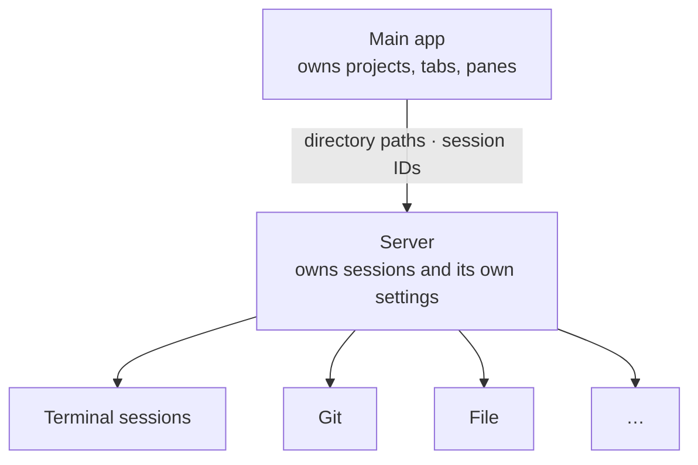
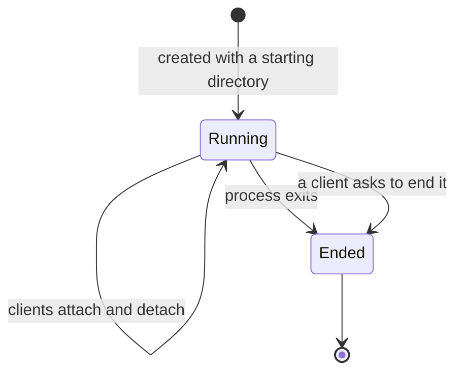

# Server model

This document defines what a server is, what it owns, and the capabilities it
provides to the main app. Communication, security, and the mechanics of
running terminals are deferred to a later design phase.

## Role

A server is a raw capability provider, modeled on a tmux server: it keeps
terminals alive on its own, and the app is a client that attaches to them and
detaches from them.

- The server knows nothing about workspaces, projects, tabs, or panes, and
  holds no app policy. Which sessions should exist, which are stale, and what
  the user sees are app decisions.
- A request about a location, such as creating a session or a Git operation,
  carries a directory path. A request about the server or an existing
  session, such as listing sessions or ending one, carries a session ID or
  nothing. A worktree project is just another directory to the server.
- The main app is the only client in this version. Nothing prevents other
  clients later, but none is defined.

## Lifecycle

- A server runs as its own process, separate from the app, which is what lets
  sessions outlive the app.
- The current-device server is bundled with the app. The app starts it at
  launch if it is not already running, and it keeps running, with or without
  sessions, until stopped from settings. Remote servers provide the same
  capabilities and are defined per type, such as SSH, Docker, or kubectl; how
  each is installed and reached is deferred.
- Stopping or restarting a server ends every session it owns. Its settings
  and saved terminal content survive; saved content never restarts a process.
  After an abrupt stop, output since the last saved checkpoint may be lost.

## Sessions

A session is a running terminal process owned by one server and identified by
a server-generated ID. It is the only server concept the app refers to by
identity: a server-bound pane holds a session ID, and the app creates a
session with the project's directory when it opens a terminal pane.

- A session runs until its process exits or a client ends it. Attached clients
  do not matter: closing the app, an app crash, or the device sleeping leave
  it running, and the server never ends or expires a session on its own.
- Any number of clients may attach at the same time. All receive the same
  output and may send input; resolving size conflicts is deferred.
- On attach, a client receives the current screen and a recent window of
  history. Older history is available in further pages until the retention
  limit is reached. The server saves the last screen and retained history,
  even while no app is connected. After the process ends, this content stays
  available by session ID until a client explicitly discards it. Ending a session
  does not shrink the history that was retained while it was live.
- The server lists its sessions with their IDs and starting directories. What
  the app does with sessions its panes no longer reference is app behavior.
- When a server is unreachable, its sessions are unreachable, not necessarily
  ended. See the app model for how panes behave.

## Capability areas

The diagram shows areas, not a fixed list. Terminal sessions are defined
above. Git provides worktree management: listing worktrees, creating one from
a branch and a directory, and removing one. File operates on paths; its scope
is defined in a future phase. Further capabilities may be added.
